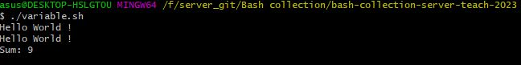
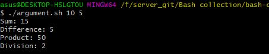
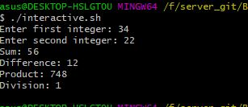
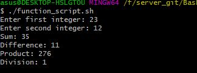
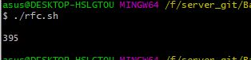

The scripts:

# Variables experiments script.
Define 3 static variables. Print them out. Try out creating a new variable that joins variables together. Try out calculating the sum of the variables.

# Command line arguments script. 
Two parameters. Print out the sum, difference and product and division of the numbers.

# Interactive input. 
Ask for two integers interactively. Test if the values are integers. If not, ask again. Repeat the same operations as in previous task.

# Functions. 
Extract the arithmetic operations from previous tasks to a function. Place the function to external file. Combine 2 and 3 so that arguments can be given as parameters or read interactively.

# RFC
Fetch N random (N from command line argument)  RFC files, print out the title of the RFCs and number of lines in the RFC.

